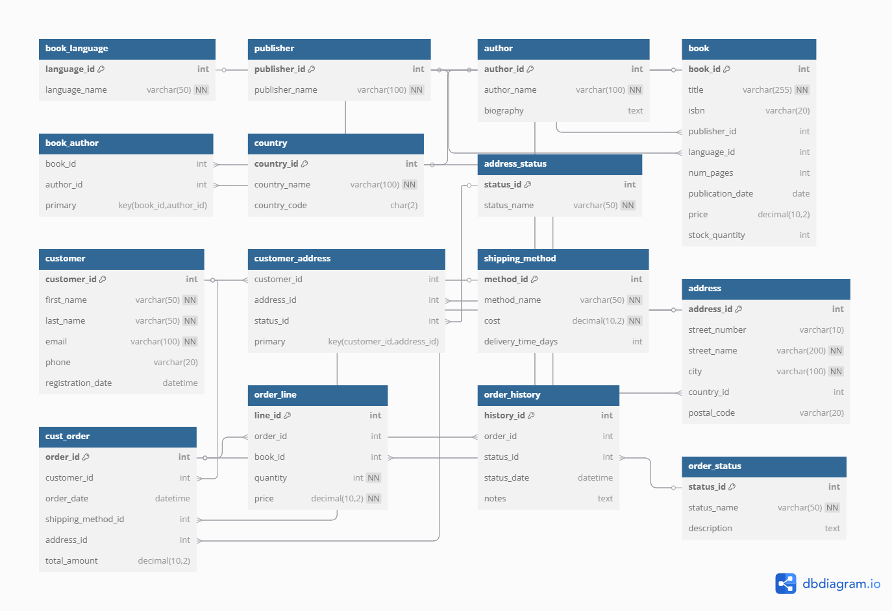

# Bookstore Database System

## Project Overview

This project provides a secure and automated setup for managing a MySQL database tailored for bookstore operations. It includes:
- Books, authors, and publishers
- Customer orders, shipping, and inventory tracking
- Role-based user access (admin, application, and analyst users)


## Database Schema




## Requirements

- **MySQL 8.0+**
- **PowerShell** (for executing the setup script)
- **A `.env` file** containing the required credentials 


## Setup Process

### Step 1: Generate and Store Credentials

Before setting up the MySQL database users, you will need to generate and store secure passwords for each user (admin, app, and analyst). The passwords are generated using PowerShell commands for added security.

1. **Create the `.env` file (for environment variables)**:
    - In the `.env` file, you will define the following variables (please note that these passwords are **generated dynamically** by PowerShell commands):
        ```
        DB_ADMIN_USER=bookstore_admin
        DB_ADMIN_PASSWORD=<generated-password>
        DB_APP_USER=bookstore_app
        DB_APP_PASSWORD=<generated-password>
        DB_ANALYST_USER=bookstore_analyst
        DB_ANALYST_PASSWORD=<generated-password>
        ```
    - The passwords are **not hardcoded** but rather **dynamically generated** by PowerShell, making them more secure.

2. **Generate secure passwords using PowerShell** (Run the following command to generate random passwords):
    ```powershell
    $adminPassword = New-RandomPassword -Length 16
    $appPassword = New-RandomPassword -Length 16
    $analystPassword = New-RandomPassword -Length 16
    ```
    - Replace `<generated-password>` in the `.env` file with the values generated by these commands.

> **Note:** The `.env` file should never be committed to version control. It contains sensitive information.


### Step 2: Run the PowerShell Setup Script

The `setup_db.ps1` script will:
- Load the credentials from the `.env` file.
- Connect to MySQL using the root password.
- Create users in MySQL with the specified permissions (admin, app, and analyst users).
- Assign the appropriate privileges to each user.

#### PowerShell Script Breakdown

1. **The PowerShell script** reads the environment variables (credentials) from the `.env` file.
2. It will create **three MySQL users**:
   - **Admin User** (`bookstore_admin`): Full access to the `bookstore` database, restricted to localhost.
   - **App User** (`bookstore_app`): Limited access (SELECT, INSERT, UPDATE, DELETE) to the `bookstore` database, with access from any host.
   - **Analyst User** (`bookstore_analyst`): Read-only access (SELECT) from internal network IPs (e.g., `10.0.%`).

3. The script ensures **security best practices** by revoking dangerous privileges like `DROP`, `CREATE USER`, and `SHUTDOWN` from the app user to prevent accidental or malicious changes.

#### How to Run the PowerShell Script

1. Open PowerShell and execute the following command:
   .\setup_db.ps1 -RootPassword "<my-mysql-root-password>"
